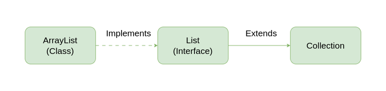

# ArrayList Implementation in Java

## 🧑‍💻 Overview
This repository contains a core Java implementation of a dynamic array, functioning similarly to Java's native `java.util.ArrayList`. Unlike standard static arrays in Java that have a fixed size, this custom `ArrayList` class automatically resizes itself when it reaches capacity, providing a highly flexible data structure.

**Conceptual Overview of ArrayList within Java's Collection Framework:**


This implementation provides fundamental dynamic array operations from scratch, making it an excellent study tool for understanding memory management, array resizing, and element shifting in memory.

## ⚙️ Features
* **Dynamic Resizing:** Automatically doubles its internal capacity (starting from an initial size of 3) when full, ensuring you never run out of bounds during insertion.
* **Flexible Insertion:** Supports appending elements to the end (`insertLast`) or inserting them at a specific index (`insertAtPosition`), automatically shifting existing elements to the right.
* **Efficient Deletion:** Allows removing the last element (`deleteLast`) or removing an element at any specific index (`deleteAtPosition`), shifting subsequent elements to the left to close the gap.
* **Integrated Search:** Includes a built-in linear search method to find the index of a target value.
* **Utility Methods:** Includes methods to print the current state of the array and retrieve its current size.

## Complexity
Understanding the constraints of this dynamic data structure:
* **Time Complexity:**
  * **Access:** $O(1)$ (Direct index access is instant).
  * **Insertion/Deletion at the End:** $O(1)$ amortized. (Worst case $O(n)$ if an insertion triggers a resize operation).
  * **Insertion/Deletion in the Middle:** $O(n)$ (Requires shifting all subsequent elements left or right).
  * **Search:** $O(n)$ (Relies on linear search).
* **Space Complexity:** $O(n)$ (Memory scales linearly with the number of elements, occasionally allocating extra space to accommodate future growth).

## How to Run

1. **Prerequisites:** Ensure you have the [Java Development Kit (JDK)](https://www.oracle.com/java/technologies/downloads/) installed on your machine.
2. **Clone the repository:**
   ```bash
   git clone [https://github.com/your-username/your-repository-name.git](https://github.com/your-username/your-repository-name.git)
